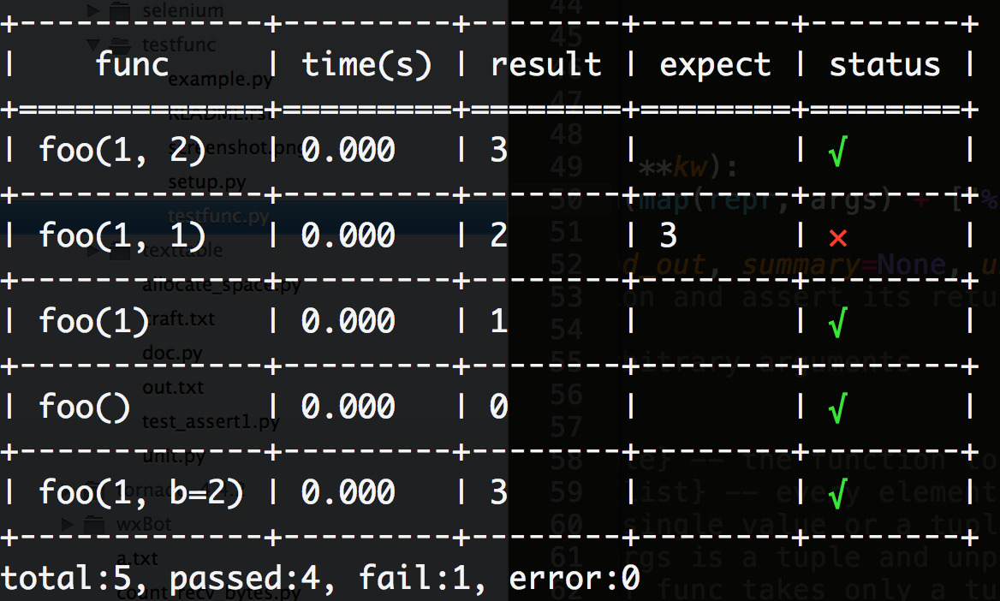

testfunc
========

introduction
------------

a simple parametrized test tool for function

example
-------

.. code:: python

    from testfunc import test

    def foo(a=0, b=0):
        return a+b

    # test_data is a list of test cases
    # a test case is the form of (args, result) or (args, kw, result)
    # if args is a tuple it will be unpacked, if this is not desired, pass `unpack=False` to `test`
    test_data = [
        (
            (1, 2),     3
        ),
        (
            (1, 1),     3
        ),
        (
            (1,),       1
        ),
        (
            (),         0
        ),
        (
            1, {'b':2}, 3
        )
    ]

    test(foo, test_data)

   screenshot

check `testfunc.py <testfunc.py>`__ for more examples.
